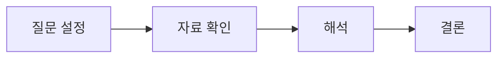
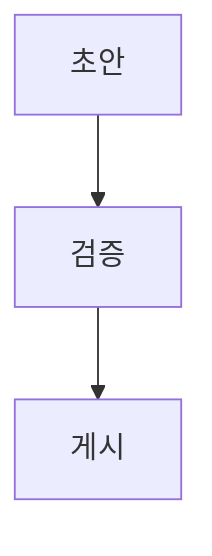

이 글은 **블로그 표시 동작을 확인하는 예시**입니다. 아래 수치는 모두 서식 검증용 가상 값이며 실제 산업·기업에 대한 분석이 아닙니다.

## 1. 핵심 질문

리서치 글은 질문, 자료, 해석과 결론을 구분해 작성합니다. 본문에서 **핵심 주장**을 강조하고, 근거는 각주로 연결할 수 있습니다.[^sample]

### 자료와 해석 구분

> 관측한 사실과 작성자의 해석을 나누어 기록합니다. 인용문은 본문과 구별되도록 표시됩니다.

1. 조사 대상과 기간을 정합니다.
2. 자료의 단위와 출처를 확인합니다.
3. 한계와 추가 검증할 내용을 남깁니다.

## 2. 비교 표

표가 화면보다 넓으면 표 영역 안에서 좌우로 스크롤할 수 있습니다. 키보드로 표 영역에 초점을 맞춘 뒤 방향키로 이동할 수도 있습니다.

| 대상 | 기준 기간 | 관측값(가상) | 비교값(가상) | 단위 | 검증 메모 |
|:---|:---|---:|---:|:---|:---|
| 예시 A | 2026년 1분기 | 100 | 120 | 지수 | 단위와 산정 기준 확인 |
| 예시 B | 2026년 2분기 | 110 | 135 | 지수 | 비교 기간의 차이 확인 |
| 예시 C | 2026년 3분기 | 125 | 150 | 지수 | 일회성 요인을 따로 기록 |

출처: 위 표는 표시 확인을 위해 작성한 가상 데이터입니다.
{:.source}

## 3. 이미지와 캡션


그림 1. 리서치 작성 과정 예시 — 직접 제작한 서식 확인용 도식
{:.image-caption}

## 4. 수식과 코드

수식은 게시글에 `mathjax: true`를 지정한 뒤 작성합니다.

$$
g = \frac{V_1 - V_0}{V_0} \times 100
$$

### 코드와 긴 주소

```python
def growth_rate(previous, current):
    return (current - previous) / previous * 100

print(growth_rate(previous=100, current=120))
very_long_identifier_for_horizontal_scroll_verification = "research-report-sample-with-a-long-line-that-must-not-expand-the-page-width"
```

긴 URL도 본문 너비 안에서 줄바꿈됩니다: <https://example.com/research/industry/technology/very-long-reference-path-for-responsive-layout-verification?source=research-style-preview&format=markdown>

## 5. 다이어그램

게시글에 `mermaid: true`를 지정하면 Mermaid 코드 블록을 도식으로 표시합니다.



같은 글 안의 두 번째 다이어그램도 표시되는지 확인합니다.



## 6. 출처와 한계

이 예시는 게시 환경을 검증하기 위한 글입니다. 실제 칼럼에는 자료 제목, 기관, 기준일, 링크와 작성자의 해석을 함께 기록합니다.

[^sample]: 각주 예시입니다. 실제 원고에는 출처와 기준일을 적습니다.
